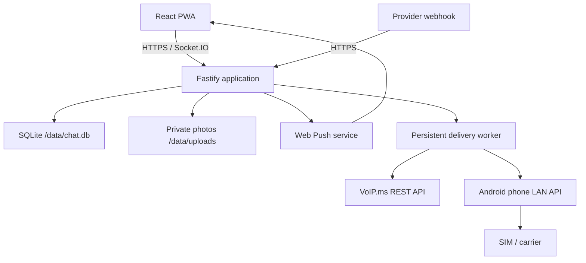

# SMS Bridge Chat

A private, self-hosted group chat where installing an app is optional. The application database is the canonical conversation; the PWA and ordinary SMS are two clients of that same conversation.

> Current build status: the text MVP, private in-app photos, and Android/SIM inbound MMS ingestion are implemented and covered by 50 automated tests. It can use either VoIP.ms or a dedicated Android phone/SIM. The remaining production gates are obtaining carrier approval for the expected automated volume and validating real Canadian/U.S. delivery. Outbound carrier MMS remains unavailable through the released Android gateway.

## What is implemented

- Mobile-first installable PWA with large touch controls, safe Markdown, replies, emoji, and reactions
- Full-history message/sender search, copy-message actions, local draft recovery, and a new-message jump control
- Pre-created members with `APP`, `SMS`, or `BOTH` delivery modes
- Six-digit SMS OTP flow, hashed challenges, bounded attempts, and durable sessions
- Secure HTTP-only session cookies plus CSRF and same-origin checks
- Canonical SQLite message history with WAL mode and automated migrations
- Socket.IO foreground realtime plus standards-based Web Push when the installed PWA is backgrounded or closed
- Authorized soft deletion for a member's own app messages and administrator moderation
- Authenticated in-app photo upload, metadata stripping, resize/compression, and private retrieval
- Administrator member management, bridge kill switch, usage display, and delivery failures
- Persistent per-recipient SMS delivery rows and provider attempt accounting
- Provider-neutral `SmsProvider` interface with isolated VoIP.ms and Android/SIM adapters
- HMAC-signed Android webhooks for inbound SMS/MMS, status, and phone health
- Idempotent provider callbacks and unknown-number allow-list behavior
- Docker/Compose packaging, Unraid-friendly ownership, mounted data, and `/health`

Incoming MMS photos from active SMS members are ingested into the private PWA conversation. PWA-to-PWA photos do not depend on MMS. The released Android gateway is receive-only for MMS, so PWA photos cannot yet be transmitted as carrier MMS to SMS-only members.

## Architecture



The `SqliteStore` is the only persistence boundary. Chat services do not depend on provider-specific request fields. VoIP.ms details are confined to `src/server/sms/voipms.ts`; Android API and webhook schemas are confined to `src/server/sms/android-gateway.ts`.

## Quick start for development

Prerequisites: Node.js 22+ and a compiler toolchain for `better-sqlite3` if a prebuilt binary is unavailable.

```bash
cp .env.example .env
```

For local development only, change these values in `.env`:

```dotenv
APP_BASE_URL=http://localhost:3000
SESSION_SECRET=development-secret-at-least-32-characters
DATABASE_PATH=./data/chat.db
UPLOADS_PATH=./data/uploads
SMS_ENABLED=false
DEV_OTP_BYPASS_CODE=123456
```

Then run:

```bash
npm ci
npm run db:migrate:dev
npm run create-admin:dev -- --name "Raphael" --phone "+14165551234"
npm run dev
```

The PWA development server opens on port `5173` and proxies API/WebSocket traffic to port `3000`. Use the administrator's phone number and the development code from `.env`.

## Docker / Unraid start

1. Copy `.env.example` to `.env` and replace every placeholder.
2. Leave `SMS_ENABLED=false` for the first boot.
3. Set `APPDATA_PATH` in your shell or Compose `.env` to an Unraid path such as `/mnt/user/appdata/sms-bridge-chat`.
4. Build and start the container:

```bash
docker compose up -d --build
docker compose exec sms-bridge-chat node dist/server/cli/create-admin.js --name "Raphael" --phone "+14165551234"
```

5. Confirm `http://UNRAID-IP:3000/health` returns:

```json
{"status":"ok","database":"ok"}
```

6. Put the application behind an HTTPS reverse proxy before using it outside a trusted LAN. Production startup deliberately fails if `APP_BASE_URL` is not HTTPS. Set `APP_BASE_URL` to the exact browser origin, such as `https://chat.example.com`; do not add a path. A mismatch produces `Request origin is not allowed` on message sends and other state changes.

All canonical state and uploads are under `/data`. Back up the mapped app-data folder plus the separately protected `.env` values to restore on another Docker host. For a consistent live SQLite backup, use Unraid Appdata Backup with the container stopped, or SQLite's online backup command rather than copying only `chat.db` while the service is writing.

## Initial administrator

The compiled container command is:

```bash
node dist/server/cli/create-admin.js --name "Name" --phone "+14165551234"
```

It creates the first member, adds the member to the default group, grants administrator access, and uses `BOTH` delivery mode. Running it again for the same normalized phone number safely restores that member as an active administrator.

## Android and iPhone background notifications

Background alerts use the standard Push API and service worker rather than keeping a WebSocket alive. While the chat is visible, Socket.IO updates the conversation without creating a redundant system alert. When the installed PWA is backgrounded or closed, a notification shows the sender and a short plain-text preview; tapping it focuses or opens the chat. The sender's own devices are excluded, expired browser subscriptions are removed automatically, and reopening always reconciles against canonical SQLite history.

Generate one VAPID key pair after installing the new image:

```bash
node dist/server/cli/generate-vapid-keys.js
```

Copy both output values into the corresponding Unraid environment fields, add `WEB_PUSH_ENABLED=true`, apply the container update, and retain the same pair for the lifetime of this deployment. The public key is intentionally sent to authenticated PWA clients; the private key never leaves the server.

On Android:

1. Open the public HTTPS URL in Chrome and choose **Install app** or **Add to Home screen**.
2. Open the installed app, sign in, then go to **Settings → Background notifications**.
3. Turn it on and accept Android's notification permission prompt.
4. If previously denied, use Android **Settings → Apps → SMS Bridge Chat (or Chrome) → Notifications** to allow it.
5. Test with the PWA fully closed by sending a message from another member or an SMS member.

The same standards-based implementation is compatible with iPhone/iPad Home Screen web apps on supported iOS releases. Safari requires the site to be added to the Home Screen before it can request push permission. iPhone members can remain `SMS`-only for the current rollout; no Apple-specific setup is required until app access is desired.

Deleting a message removes its content from PWA history. A member can delete their own app-originated message, and an administrator can remove any message. SMS copies already sent to phones cannot be recalled, so the interface retains a `Message removed` tombstone and warns before deletion.

## In-app photo attachments

Use the **＋** button in the composer to choose a JPEG, PNG, WebP, or AVIF photo. The server verifies that the bytes decode as an image, rejects oversized or animated input, applies camera orientation, removes metadata, limits the dimensions, and stores a WebP file under `/data/uploads`. Attachment URLs require an active group session and use `private, no-store` browser caching; they are not public share links. If a phone saves high-efficiency HEIC photos, configure its camera for JPEG compatibility before uploading.

A caption is optional. The default upload limit is 5 MB and the default maximum processed dimension is 1920 pixels. These can be adjusted with `IMAGE_UPLOAD_MAX_BYTES`, `IMAGE_MAX_DIMENSION`, and `IMAGE_WEBP_QUALITY`. Keep `/data/uploads` in the same backup set as `chat.db`.

Photos uploaded in the PWA travel PWA-to-PWA. SMS members receive `[Photo — view in app]` with any caption, without exposing a public media URL.

With the Android/SIM provider, an active SMS member can also send a photo MMS to the gateway number. The signed `mms:downloaded` callback is allow-listed by sender and destination, deduplicated by the provider message ID, decoded or fetched through the phone's private inbox API, validated as an image, stripped of metadata, resized, and stored in `/data/uploads`. It then appears as an ordinary photo in the PWA. The original sender is not echoed; other SMS-only members receive the text caption and private-app photo marker.

The released SMS Gateway for Android API currently supports **receiving MMS only**. It does not expose an outbound MMS request, so the bridge deliberately does not claim to send PWA photos to SMS-only members as MMS. See the gateway's [MMS support documentation](https://docs.sms-gate.app/features/mms/). Do not install an unmerged development APK on the production relay phone solely to bypass this limitation.

## Android phone and physical SIM setup

The SIM is not mounted into Docker. The Android phone is an always-on network appliance: the container submits outbound jobs to the phone's private LAN API, while the phone sends signed HTTPS callbacks to this application for inbound SMS, delivery status, startup, and health events. USB is needed only for power.

The integration uses the Apache-2.0 [SMS Gateway for Android](https://github.com/capcom6/android-sms-gateway) project in Local Server mode. Use the project's [current installation guide](https://docs.sms-gate.app/installation/) and secure release APK as the source of truth.

### 1. Prepare the SIM and phone

1. Use a carrier-supported LTE/VoLTE Android phone that still receives security updates. Confirm its IMEI/model is accepted by the selected carrier.
2. Activate the SIM and manually test ordinary SMS in both directions with one Canadian and one U.S. phone. Confirm the plan includes Canada-to-U.S. SMS, not only domestic texting.
3. In Google Messages, open Profile → Messages settings → RCS chats and turn RCS off for the gateway number. The bridge receives SMS/MMS events, not RCS conversations.
4. If the number was previously attached to an iPhone, deregister it from iMessage before moving it to Android.
5. Disable the SIM PIN so an unattended reboot can reconnect to the cellular network.
6. Give the phone stable Wi-Fi and reserve its address in DHCP. If the router uses the Wi-Fi MAC for reservations, disable the randomized MAC for this SSID or reserve the displayed per-network MAC.
7. Keep the phone on a reliable charger, preferably backed by the same UPS as Unraid. Enable the manufacturer's 80–85% battery-protection limit, keep the phone cool, and remove it from any sleeping/deep-sleeping app list.
8. Set the SMS Gateway app's battery usage to Unrestricted/Not optimized, allow background operation, and retain its foreground-service notification.

### 2. Configure SMS Gateway for Android

1. Install the secure release APK and grant `SEND_SMS`, `RECEIVE_SMS`, `RECEIVE_MMS`, and `READ_PHONE_STATE`. `READ_SMS` is optional and is not needed for live bridging. Keep mobile data enabled for the gateway SIM because many carriers download MMS over the cellular APN even while Wi-Fi is connected.
2. On the Home tab, note the displayed **Device ID**.
3. Enable **Local Server**, tap **Offline** so it becomes **Online**, and note:
   - the phone's local IP and port `8080`
   - Local Server username
   - Local Server password
4. Create a unique random `ANDROID_GATEWAY_WEBHOOK_SIGNING_KEY` of at least 32 characters in Unraid. The callback-registration command applies it to the phone through the write-only settings API, so it does not need to be copied through Swagger manually.
5. Open Settings → Ping and enable a 60-second interval. The app uses these signed `system:ping` events for battery, network, version, and stale-phone warnings.
6. Open Settings → Messages:
   - choose **FIFO** processing so queued chat messages retain conversation order
   - use normal priority; the bridge intentionally submits priority `0` so phone-side pacing remains active
   - start with a modest random delay such as 2–4 seconds between sends
   - set minute/hour/day limits no higher than the volume explicitly permitted by the carrier
   - leave working hours disabled for an always-available family chat
7. Confirm the gateway returns to Online after a phone reboot. Do not assume this until it has been tested on the selected phone/OEM firmware.

The phone's Local Server Swagger page is available only on the LAN at `http://PHONE-IP:8080/docs`. Never port-forward port `8080` to the internet.

### 3. Configure Unraid environment values

On the first Android configuration boot, keep `SMS_ENABLED=false` while filling every value:

```dotenv
SMS_PROVIDER=android_gateway
SMS_ENABLED=false
SMS_DAILY_LIMIT=100

ANDROID_GATEWAY_URL=http://192.168.50.25:8080
ANDROID_GATEWAY_USERNAME=copy-from-phone
ANDROID_GATEWAY_PASSWORD=copy-from-phone
ANDROID_GATEWAY_PHONE_NUMBER=+14165551234
ANDROID_GATEWAY_DEVICE_ID=copy-from-phone-home-tab
ANDROID_GATEWAY_WEBHOOK_SECRET=generate-a-separate-long-random-value
ANDROID_GATEWAY_WEBHOOK_SIGNING_KEY=exactly-match-the-phone-signing-key
ANDROID_GATEWAY_SIM_NUMBER=1
ANDROID_GATEWAY_TTL_SECONDS=3600
ANDROID_GATEWAY_DELIVERY_REPORTS=true
ANDROID_GATEWAY_WEBHOOK_MAX_SKEW_SECONDS=300
ANDROID_GATEWAY_HEALTH_STALE_SECONDS=180
```

Use the `simNumber` reported by the phone's `/device` response, not `slotIndex`. For example, `{"simNumber":2,"slotIndex":1}` requires `ANDROID_GATEWAY_SIM_NUMBER=2`.

`APP_BASE_URL` must already be the application's externally valid HTTPS origin. The phone calls:

```text
https://chat.example.com/api/webhooks/android/ANDROID_GATEWAY_WEBHOOK_SECRET
```

If the phone cannot reach that public hostname from the home network, configure split DNS so the hostname resolves to the reverse proxy's LAN address. Do not replace it with a private HTTP URL: the secure gateway build requires HTTPS for non-loopback webhooks.

### 4. Register callbacks from inside the container

Restart the container so it receives the new environment values, then run:

```bash
docker compose exec sms-bridge-chat node dist/server/cli/configure-android-gateway.js
```

On Unraid's Docker console, the equivalent command is:

```bash
node dist/server/cli/configure-android-gateway.js
```

The command first checks the phone's `/health` endpoint, applies `ANDROID_GATEWAY_WEBHOOK_SIGNING_KEY` through the phone's write-only settings API, then safely replaces only the deterministic `sms-bridge-chat-*` registrations for `sms:received`, `mms:received`, `mms:downloaded`, `sms:sent`, `sms:delivered`, `sms:failed`, `sms:cancelled`, `system:ping`, and `app:started`. It never prints the phone credentials, signing key, or webhook URL secret.

After registration, restart the gateway app once and confirm the Admin screen shows the carrier/check-in rather than `stale`. Then change `SMS_ENABLED=true` and restart the container.

If an inbound SMS appears on the phone but not in the PWA, open **Admin → Recent inbound diagnostics**. It distinguishes an invalid callback signature, wrong device/SIM, paused bridge, invalid destination, and a sender number that does not exactly match an active member. The gateway's `phoneNumber` legacy sender field is accepted for compatibility with older releases. The header's `SMS connected` label means the bridge is enabled; the Android gateway card's recent check-in confirms that callbacks are actually arriving.

### 5. Network rules

No USB device mapping, privileged Docker mode, or host networking is required. A normal Docker bridge can route to a separate LAN device.

- Allow the SMS Bridge container/Unraid IP to reach the phone on TCP `8080`.
- Allow the phone to reach the HTTPS reverse proxy on TCP `443`.
- Prefer an IoT VLAN that denies the phone access to the rest of the LAN.
- Never expose TCP `8080` through router port forwarding, a public tunnel, or the reverse proxy.
- Keep the Local Server username/password, webhook URL secret, and HMAC signing key only in the protected deployment environment.

### 6. Activation test

1. Send one PWA message to one Canadian SMS member.
2. Reply to the SIM number and confirm the reply appears once in the PWA under the correct member.
3. Add a second SMS member and confirm fan-out occurs without echoing back to the sender.
4. Test one U.S. recipient in each direction.
5. Test a long message and an emoji; these can consume multiple carrier SMS segments.
6. Turn off cellular service, send a PWA message, and confirm canonical chat remains available and the delivery failure is visible.
7. Re-enable service and use the administrator Retry action.
8. Reboot the phone, router, and container and confirm phone health and message flow recover.
9. Send one JPEG photo by MMS from a known member to the gateway number and confirm it appears once in the PWA. This validates inbound only; the released phone gateway cannot send outbound MMS.

Begin with `SMS_DAILY_LIMIT=100` and increase it only after observing real usage and receiving carrier approval. At 100 group messages/day, 10–12 SMS recipients can create roughly 900–1,200 outbound deliveries/day before multipart expansion.

Consumer “unlimited” does not necessarily authorize an automated gateway. The SMS Gateway project itself cautions against batch sending because of operator restrictions. For example, [Freedom Mobile's Fair Usage Policy](https://www.freedommobile.ca/docs/default-source/default-document-library/data-fair-usage-policy.pdf) permits action when unlimited messaging grossly exceeds typical consumer use. Obtain written confirmation for the intended private relay and Canada/U.S. traffic before treating a low-cost consumer SIM as production-safe.

## VoIP.ms callback route

The inbound route is:

```text
GET /api/webhooks/voipms/:secret
```

Configure the DID callback with URL-encoded substitutions:

```text
https://chat.example.com/api/webhooks/voipms/LONG_RANDOM_SECRET?to={TO}&from={FROM}&message={MESSAGE}&id={ID}&timestamp={TIMESTAMP}&media={MEDIA}
```

The handler checks the secret and destination DID, normalizes the sender, applies the active-member allow-list, and uses the VoIP.ms ID as an idempotency key. It returns the exact text `ok` only after the canonical message and all delivery jobs have committed. Slow outbound calls never run in the callback request.

`src/server/sms/voipms.ts` is the only code that knows the VoIP.ms outbound field names. The publicly documented common authentication fields and `sendSMS` method are implemented, but the owner must compare `did`, `dst`, and `message` against the current method reference inside Main Menu → SOAP & REST/JSON API. Set `VOIPMS_SENDSMS_PARAMS_VERIFIED=true` only after that comparison.

## Owner's VoIP.ms setup checklist

Use the current [VoIP.ms SMS/MMS instructions](https://wiki.voip.ms/article/SMS-MMS) and [API overview](https://wiki.voip.ms/article/API_Overview) as the source of truth while completing these steps:

1. Confirm the existing DID shows SMS/MMS support.
2. Enable Message Service/SMS/MMS on that DID.
3. Open Main Menu → SOAP and REST/JSON API and enable API access.
4. Create a dedicated API password. Do not reuse or paste the portal password.
5. Add the Unraid/public egress IP or approved DNS/CIDR to the API allow-list. The `getIP` method can show the address VoIP.ms sees.
6. Select E.164 dialing mode for SMS/API and store the DID as `+1...` in `.env`.
7. Create a long random `VOIPMS_WEBHOOK_SECRET` and configure this callback, retaining every substitution variable:

   ```text
   https://chat.example.com/api/webhooks/voipms/SECRET?to={TO}&from={FROM}&message={MESSAGE}&id={ID}&timestamp={TIMESTAMP}&media={MEDIA}
   ```

8. Ensure the proxy/provider safely URL-encodes substituted values.
9. Enable URL Callback Retry. The application returns exact lowercase `ok` after durable persistence, so duplicate retries are safe.
10. Send a real inbound SMS and confirm one canonical PWA message appears.
11. Send a PWA message and confirm each intended SMS/BOTH member receives one sender-prefixed SMS.
12. Complete any messaging/A2P verification VoIP.ms requires for API traffic and confirm that this private conversational bridge is acceptable for the account.
13. VoIP.ms documents a default API-originated limit of 100 messages/day. Request a higher limit if appropriate, then change `SMS_DAILY_LIMIT` to the approved value.
14. Compare the current portal-only `sendSMS` fields with the isolated adapter, then set `VOIPMS_SENDSMS_PARAMS_VERIFIED=true`.
15. Only after all prior checks, set `SMS_ENABLED=true` and restart the container.

Do not send credentials through chat or commit them. Put them directly in the deployment's protected `.env`/secret configuration.

## Reverse proxy and webhook privacy

VoIP.ms's standard callback puts private message text in a GET query. The Android callback puts the webhook secret in the URL path and the message in a signed JSON body. The application disables automatic request logging and only records route templates, never full URLs or bodies. The reverse proxy must follow the same rule. For Nginx, disable access logging for all provider callbacks while retaining normal logs elsewhere:

```nginx
location ^~ /api/webhooks/ {
    access_log off;
    proxy_pass http://127.0.0.1:3000;
    proxy_set_header Host $host;
    proxy_set_header X-Forwarded-Proto https;
    proxy_set_header X-Forwarded-For $proxy_add_x_forwarded_for;
}

location /socket.io/ {
    proxy_pass http://127.0.0.1:3000;
    proxy_http_version 1.1;
    proxy_set_header Upgrade $http_upgrade;
    proxy_set_header Connection "upgrade";
    proxy_set_header Host $host;
}

location / {
    proxy_pass http://127.0.0.1:3000;
    proxy_set_header Host $host;
    proxy_set_header X-Forwarded-Proto https;
    proxy_set_header X-Forwarded-For $proxy_add_x_forwarded_for;
}
```

In Nginx Proxy Manager, create a custom location for `/api/webhooks/` and add `access_log off;` to that location rather than adding a second nested `location` block to a generated server. Check upstream CDN/tunnel logging too. Each provider secret is part of the path, so these routes should not appear in access logs at all. Do not enable request-body logging on the Android callback route.

Keep `TRUST_PROXY=false` if the app port is directly reachable. When only a reverse proxy can reach it, set `TRUST_PROXY` to that proxy's exact IP/CIDR so forwarded client addresses can be used safely for rate limiting. Avoid a blanket `true` unless the entire network path is controlled.

## Required real-phone validation

Before calling the deployment production-ready, test this matrix with actual phones:

- Canadian PWA → Canadian SMS
- Canadian SMS → PWA and another SMS member, with no sender echo
- U.S. PWA/SMS member in both directions
- One message containing emoji and one containing a full HTTPS link
- A deliberate duplicate callback using the same provider ID
- Provider credentials temporarily disabled while a PWA message is sent, followed by retry recovery
- Bridge kill switch while ordinary PWA chat continues
- Usage warnings at configured 80%, 95%, and 100% thresholds

Do not experiment with outbound carrier MMS until this text matrix passes. Private in-app photos and supported inbound MMS ingestion do not require outbound MMS capability.

## Safety defaults

- `SMS_ENABLED=false` prevents accidental provider traffic.
- `SMS_PROVIDER` selects exactly one bridge; the unused provider's credentials are ignored.
- When `SMS_PROVIDER=voipms`, `VOIPMS_SENDSMS_PARAMS_VERIFIED=false` independently blocks sends until the owner compares `did`, `dst`, and `message` with the current account-portal `sendSMS` method reference.
- The Android adapter supplies a stable delivery UUID as the gateway message ID and checks that ID after an ambiguous HTTP failure before allowing a retry.
- Every outbound provider call, including an OTP, consumes one daily-limit unit.
- At 100%, canonical messages continue but SMS deliveries become `SKIPPED_LIMIT`.
- A delivery that was already `SENDING` during an unclean restart is marked failed with an uncertain-provider-state message instead of being silently resent and potentially duplicated.
- Application logs do not include request URLs/query strings, message bodies, codes, tokens, cookies, or credentials.

## Commands

| Command | Purpose |
| --- | --- |
| `npm run dev` | Run the API and PWA development servers |
| `npm test` | Run automated integration and reliability tests |
| `npm run security:audit` | Check production dependencies for published vulnerabilities |
| `npm run typecheck` | Type-check server and PWA |
| `npm run build` | Build production server and static PWA |
| `npm run db:migrate:dev` | Apply local database migrations |
| `npm run create-admin:dev -- --name ... --phone ...` | Bootstrap an administrator locally |
| `npm run create-admin -- --name ... --phone ...` | Bootstrap an administrator after production build |
| `npm run configure-android-gateway:dev` | Check the phone and register signed callbacks during development |
| `npm run configure-android-gateway` | Check the phone and register signed callbacks after production build |
| `npm run generate-vapid-keys` | Generate the one-time Web Push public/private key pair |

The GitHub CI workflow repeats tests, the production build, and a real `docker build`. The package workflow publishes `ghcr.io/<owner>/sms-bridge-chat:latest` on every `main` release; manual runs and version tags are also supported. No `.env` values are embedded in the image.

## Automated coverage

`npm test` currently runs 50 tests covering:

- OTP sessions, CSRF, member administration, persistence, and authenticated Socket.IO delivery
- Known/unknown inbound numbers, wrong DID, bad secret, duplicate provider IDs, and bridge shutdown
- PWA fan-out, SMS fan-out, and the no-sender-echo rule
- Provider outage, permanent errors, bounded transient retries, restart recovery, and uncertain in-flight safety
- Daily-limit enforcement and warning thresholds while canonical chat continues
- Markdown-to-SMS degradation, full-link preservation, reply quoting, and reaction suppression
- Isolated VoIP.ms request mapping and the mandatory owner-verification gate
- Android Local Server request mapping, Basic authentication, stable gateway IDs, and ambiguous-request recovery
- HMAC validation, stale/replayed callback rejection, inbound idempotency, delivery statuses, and gateway health events
- Web Push subscription security, background fan-out, sender exclusion, and expired-endpoint cleanup
- Own-message/admin deletion authorization, tombstones, and non-retractable SMS behavior
- Authenticated photo upload/retrieval, content validation, conversion, size limits, deletion privacy, and SMS fallback text
- Signed inbound MMS image ingestion, provider-ID deduplication, private storage/retrieval, sender allow-list behavior, and no sender echo

## Environment

The complete, comment-documented list is in `.env.example`. Secrets are server-only and must never be embedded in frontend variables or committed. `SESSION_SECRET` must be at least 32 characters in production. `WEB_PUSH_VAPID_PRIVATE_KEY` is server-only; the corresponding public key is safe for browser subscriptions. `DEV_OTP_BYPASS_CODE` is rejected in production.

## Milestones

- [x] Milestone 1 — canonical local chat, authentication, administration, PWA, history, realtime
- [x] Milestone 2 — inbound callback, phone mapping, sender allow-list, idempotency
- [x] Milestone 3 — provider adapter, durable per-recipient fan-out queue, sender prefixes
- [x] Milestone 4 — retries, limits, outage handling, monitoring, redacted logs
- [x] Milestone 5 — safe Markdown, replies, reactions, link-preserving SMS rendering
- [x] Milestone 6a — private in-app image uploads, processing, storage, display, and SMS fallback marker
- [x] Milestone 6b — Android/SIM inbound MMS ingestion into the canonical PWA conversation
- [ ] Milestone 6c — outbound carrier MMS, blocked on a stable released provider API and real-phone validation

See `docs/IMPLEMENTATION_STATUS.md` for the remaining production assumptions and intentionally deferred work.
